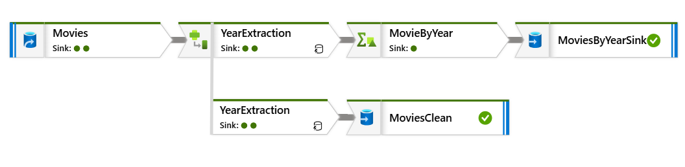

# Azure Data Factory - Mapping Data Flow (Mini Project)

  

## 💡 Objective

- Extract the release year from movie titles (e.g., `"Jumanji(1998)"` ➝ `Title: Jumanji`, `Year: 1998`)
- Clean movie titles by removing the year
- Aggregate the number of movies per year
- Output cleaned and aggregated data to Azure Blob Storage

## 📁 Setup

- **Blob Containers**:
  - `input`: Contains `Movies.csv`
  - `output`: Stores the results

## 🔧 Data Flow Steps

1. **Source** (`Movies`)
   - Reads the input data from the blob storage.

2. **Year Extraction** (Branch 1)
   - Extracts the year from the `title` column using regex.
   - Cleans the `title` by removing the year.

3. **Sink 1** (`MoviesClean`)
   - Writes the cleaned movie data to a single output file.

4. **Year Aggregation** (Branch 2)
   - Aggregates the movie count by year.

5. **Sink 2** (`MoviesByYearSink`)
   - Writes the movie count per year to a single output file.

## 📊 Output

- `MoviesClean.csv` – Cleaned movie titles with extracted year
- `MoviesByYear.csv` – Movie count per year

---

📚 *This mini project was created by following a tutorial on YouTube as part of my learning journey with Azure Data Factory.*

